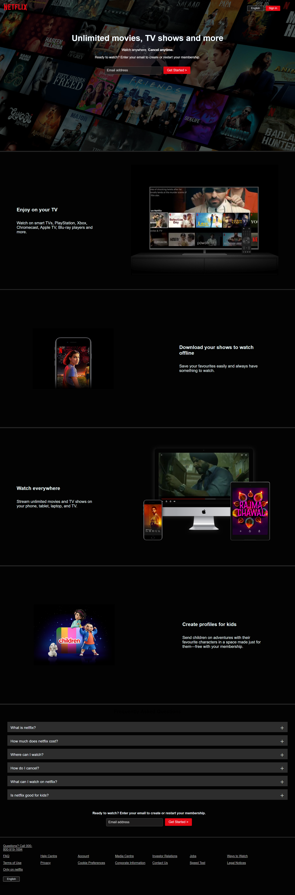

# Netflix Clone 🌐

# Project Details :
- PROJECT TITLE      : Netflix Clone 

# 🚀Features :
✅ Responsive Design

✅ Beautiful Netflix-style UI

✅ Organized HTML structure

✅ Styled with pure CSS (no frameworks)

✅ FAQ section with expandable answers

# Project Description : 
A fully responsive and visually stunning Netflix homepage clone, built using HTML5 and CSS3. This project replicates the official Netflix landing page, featuring a modern UI, a hero section, feature highlights, and an FAQ section. It serves as a great front-end practice project for beginners and intermediate developers looking to sharpen their HTML & CSS skills.

# Technologies Used :
1. HTML5 for structuring content
2. CSS3 for styling and layout

# 📸 Project Preview :

